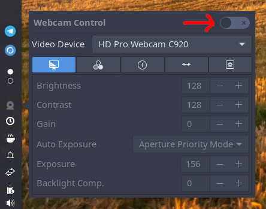
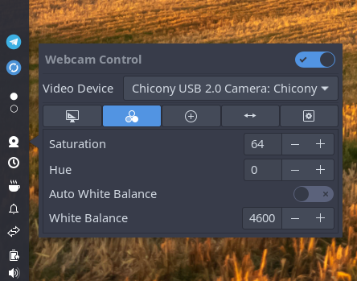

# Budgie Webcam Applet

[](https://github.com/pgroenbaek/budgie-webcam-applet/releases)
[![License GNU GPL v3](https://img.shields.io/badge/License-%20%20GNU%20GPL%20v3%20-lightgrey?style=flat&logo=data:image/svg+xml;base64,PHN2ZyB4bWxucz0iaHR0cDovL3d3dy53My5vcmcvMjAwMC9zdmciIHZpZXdCb3g9IjAgMCA2NDAgNTEyIj4KICA8IS0tIEZvbnQgQXdlc29tZSBGcmVlIDYuNy4yIGJ5IEBmb250YXdlc29tZSAtIGh0dHBzOi8vZm9udGF3ZXNvbWUuY29tIExpY2Vuc2UgLSBodHRwczovL2ZvbnRhd2Vzb21lLmNvbS9saWNlbnNlL2ZyZWUgQ29weXJpZ2h0IDIwMjUgRm9udGljb25zLCBJbmMuIC0tPgogIDxwYXRoIGZpbGw9IndoaXRlIiBkPSJNMzg0IDMybDEyOCAwYzE3LjcgMCAzMiAxNC4zIDMyIDMycy0xNC4zIDMyLTMyIDMyTDM5OC40IDk2Yy01LjIgMjUuOC0yMi45IDQ3LjEtNDYuNCA1Ny4zTDM1MiA0NDhsMTYwIDBjMTcuNyAwIDMyIDE0LjMgMzIgMzJzLTE0LjMgMzItMzIgMzJsLTE5MiAwLTE5MiAwYy0xNy43IDAtMzItMTQuMy0zMi0zMnMxNC4zLTMyIDMyLTMybDE2MCAwIDAtMjk0LjdjLTIzLjUtMTAuMy00MS4yLTMxLjYtNDYuNC01Ny4zTDEyOCA5NmMtMTcuNyAwLTMyLTE0LjMtMzItMzJzMTQuMy0zMiAzMi0zMmwxMjggMGMxNC42LTE5LjQgMzcuOC0zMiA2NC0zMnM0OS40IDEyLjYgNjQgMzJ6bTU1LjYgMjg4bDE0NC45IDBMNTEyIDE5NS44IDQzOS42IDMyMHpNNTEyIDQxNmMtNjIuOSAwLTExNS4yLTM0LTEyNi03OC45Yy0yLjYtMTEgMS0yMi4zIDYuNy0zMi4xbDk1LjItMTYzLjJjNS04LjYgMTQuMi0xMy44IDI0LjEtMTMuOHMxOS4xIDUuMyAyNC4xIDEzLjhsOTUuMiAxNjMuMmM1LjcgOS44IDkuMyAyMS4xIDYuNyAzMi4xQzYyNy4yIDM4MiA1NzQuOSA0MTYgNTEyIDQxNnpNMTI2LjggMTk1LjhMNTQuNCAzMjBsMTQ0LjkgMEwxMjYuOCAxOTUuOHpNLjkgMzM3LjFjLTIuNi0xMSAxLTIyLjMgNi43LTMyLjFsOTUuMi0xNjMuMmM1LTguNiAxNC4yLTEzLjggMjQuMS0xMy44czE5LjEgNS4zIDI0LjEgMTMuOGw5NS4yIDE2My4yYzUuNyA5LjggOS4zIDIxLjEgNi43IDMyLjFDMjQyIDM4MiAxODkuNyA0MTYgMTI2LjggNDE2UzExLjcgMzgyIC45IDMzNy4xeiIvPgo8L3N2Zz4=&logoColor=%23ffffff)](/LICENSE)

This Budgie panel applet provides easy access to common webcam controls like exposure, color balance, and focus.

The applet communicates directly with the device drivers using the Linux `ioctl` system call, and only shows controls that are actually available for each specific device.

## Installing
Find and download the `.deb` package in the [latest release](https://github.com/pgroenbaek/budgie-webcam-applet/releases).

Install using the command:
```bash
sudo dpkg -i budgie-webcam-applet_<version>_amd64.deb
```

## Usage
1. Add the applet to your Budgie panel in the *Budgie Desktop Settings* application.

2. Click the tray icon.

3. Enable the applet to control the webcam using the "Webcam Control" switch shown below.



### Selecting Video Device

Use the video device selector to choose which webcam or video device to control. The applet automatically lists any devices with adjustable controls.


### Controls

Available controls depend on the selected device. You can adjust settings such as exposure, white balance, focus, zoom, and orientation directly from the applet.




## Building
### Prerequisites

Ensure you have the required dependencies installed:

```bash
sudo apt install budgie-desktop budgie-core budgie-core-dev
sudo apt install libgtk-3-dev libglib2.0-dev gettext v4l-utils 
sudo apt install meson ninja-build valac
```


### Building the applet

To build the `.so` library with meson/ninja:

```bash
meson setup build
ninja -C build
```

### Packaging

#### Debian

To package the applet `.deb` package for Debian:

```bash
dpkg-buildpackage -us -uc
```

## Contributing

Contributions of all kinds are welcome. This project uses a pull request workflow with squash merges to keep history for the `master` branch clean.

### How It Works

- **Pull requests required:** All changes must come through a PR.
- **Squash merges only:** Each PR is merged as a single commit to `master`.
- **Conventional commits:** Please use structured commit messages for the squash merge commit, e.g., `feat: add new feature` or `fix: resolve bug in widget`.
- **PR reviews:** PRs must be reviewed by a maintainer with write access before merging.

The project is kept organized and welcoming for all contributors by following this workflow. Feel free to open issues, suggest features or submit a PR.

More details are available in the [contribution guidelines](/CONTRIBUTING.md).


## License
This Budgie panel applet was created by Peter Grønbæk Andersen and is licensed under [GNU GPL v3](/LICENSE).
